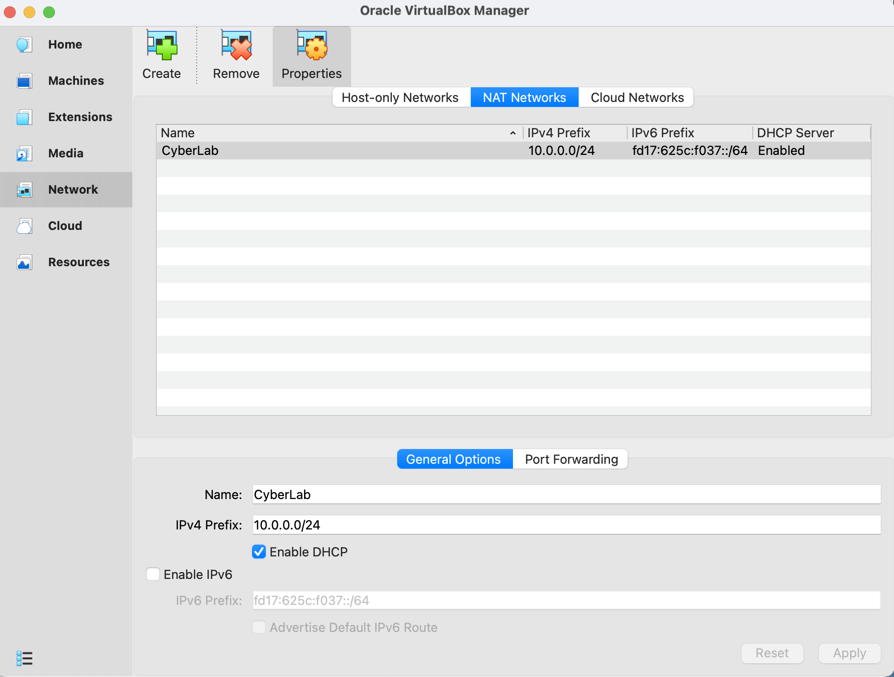
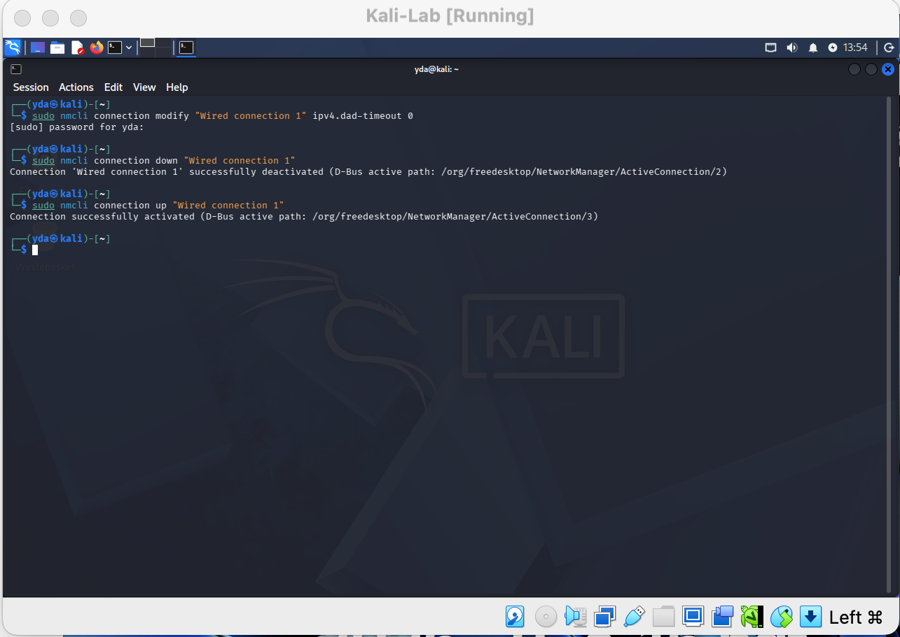
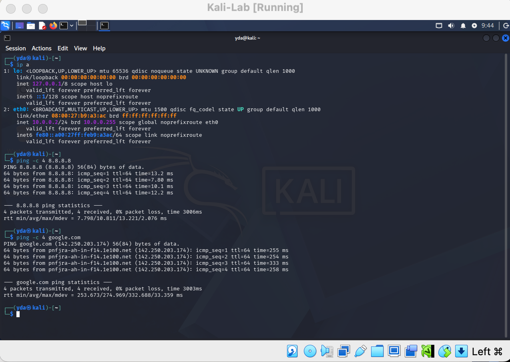

# Cybersecurity Lab Environment Setup

Building an isolated virtual lab for penetration testing and ethical hacking practice.

`Skill: Cybersecurity` `Ver: VirtualBox v7.2` `Kali Linux 2026.2` `Skill: Linux` `Network: 10.0.0.0/24` `Skill: Penetration Testing` `Skill: Virtualization` `GitHub` `Kali Linux` `NetworkWalks` `Ethical Hacking`

##  Project Overview

This project focuses on setting up a **virtual cybersecurity and penetration-testing laboratory** using VirtualBox and Kali Linux.

The purpose of the lab is to create a controlled environment where cybersecurity tools, network scanning, reconnaissance, vulnerability assessment, and other security-testing activities can be performed safely and repeatedly.

The lab is configured on a private virtual network so that additional machines can be added later and used as targets for authorized security testing.

##  Tools Used

- Oracle VirtualBox 
- Kali Linux 
- NAT Network 

##  Network Configuration

| Setting | Value |
|---|---|
| Network Type | NAT Network (custom) |
| Subnet | 10.0.0.0/24 |
| Kali Linux IP | 10.0.0.2/24 |
| Gateway | 10.0.0.1 |
| DNS | 8.8.8.8 (fallback 10.0.0.1) |

##  Steps 

1. Installed and extract the Kali Linux VM .
2. Installed  Oracle VirtualBox.
3. Created a custom NAT Network (`NatNetwork`) with subnet `10.0.0.0/24` and DHCP enabled.
4. Downloaded and imported the official Kali Linux VirtualBox appliance.
5. Attached the Kali VM's network adapter to the custom NAT Network.
6. Enabled clipboard sharing and drag-and-drop (bidirectional) in VM settings.
7. Enabled a shared folder mapping the host's `/downloads` folder into the VM.
8. Configured Kali Linux with a manual/static IP: `10.0.0.2/24`, gateway `10.0.0.1`.
9. Verified full internet access from Kali (`ping 8.8.8.8`, `ping google.com`).


##  Screenshots

**NAT Network configuration**


**Kali Linux VM network adapter settings**


**Static IP configuration in Kali**


**Successful ping test (internet access confirmed)**


**VM kali taken**


##  Troubleshooting Notes

If Kali loses internet access after setting a static IP  run:

```bash
sudo nmcli connection modify "Wired connection 1" ipv4.dad-timeout 0
sudo nmcli connection down "Wired connection 1"
sudo nmcli connection up "Wired connection 1"
```

Then restart the Kali VM and host machine.

##  Result

Successfully built a working, internet-connected Kali Linux VM on an isolated 10.0.0.0/24 NAT network, ready for future penetration-testing and cybersecurity practice labs.

---
*This project is for educational and authorized lab-testing purposes only, as part of the NetworkWalks Cybersecurity Internship program.*
